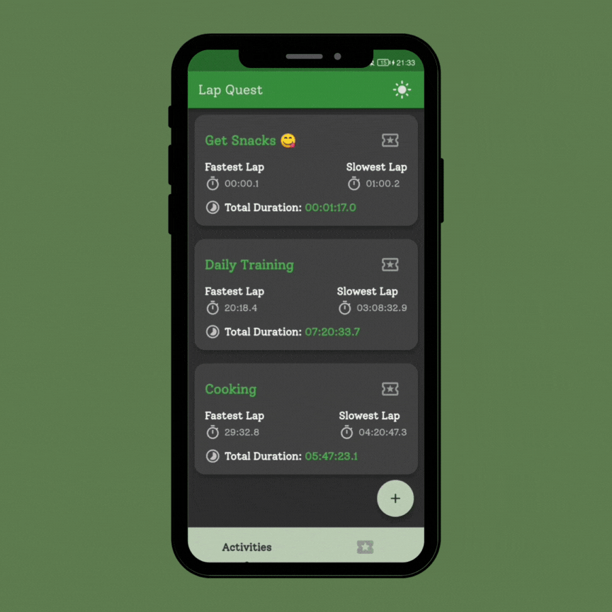
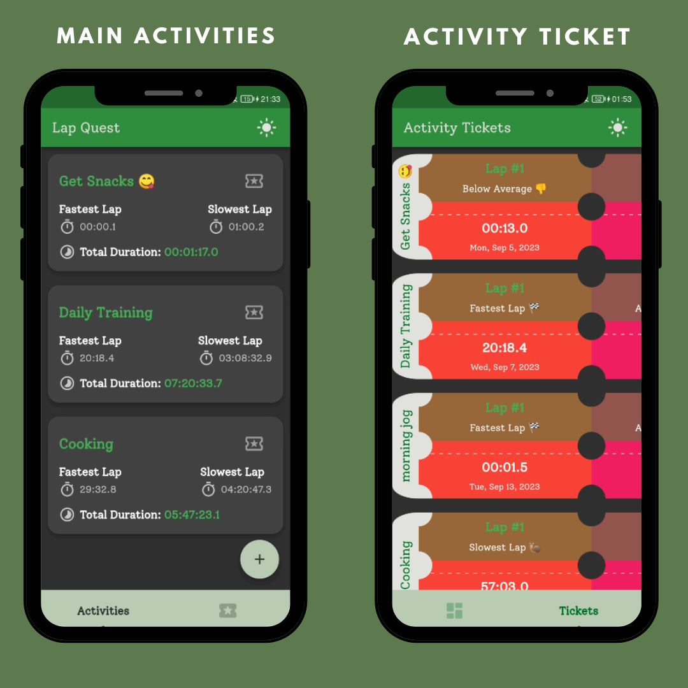
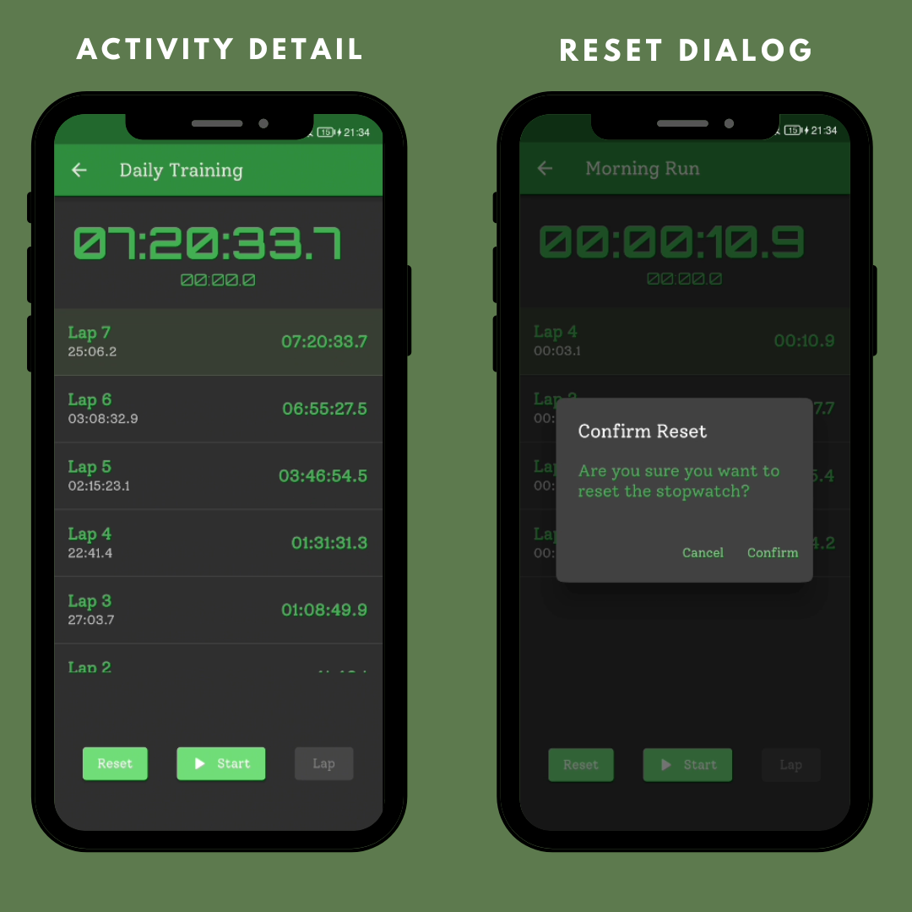
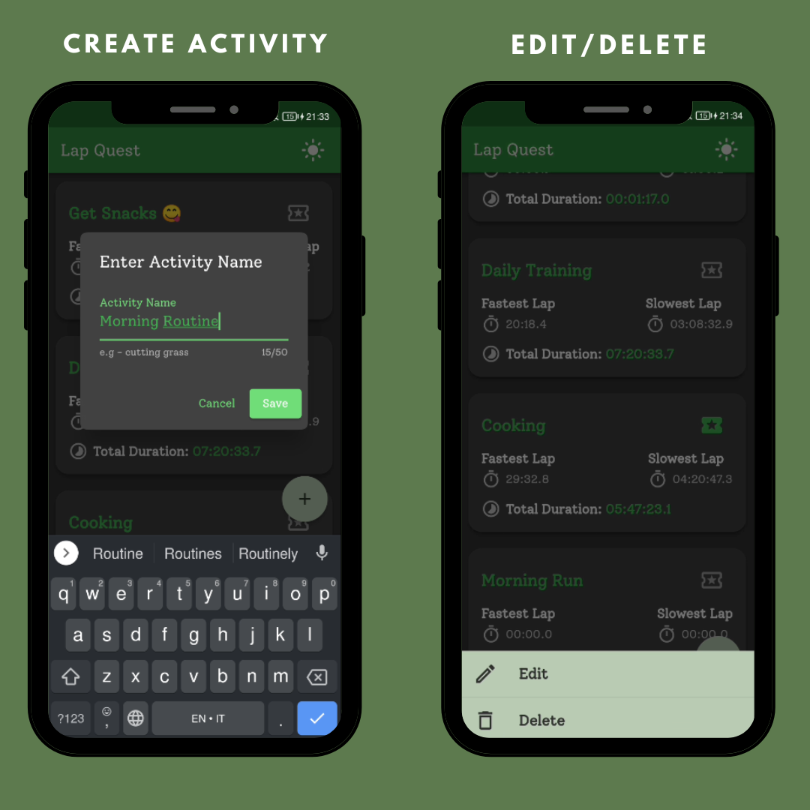
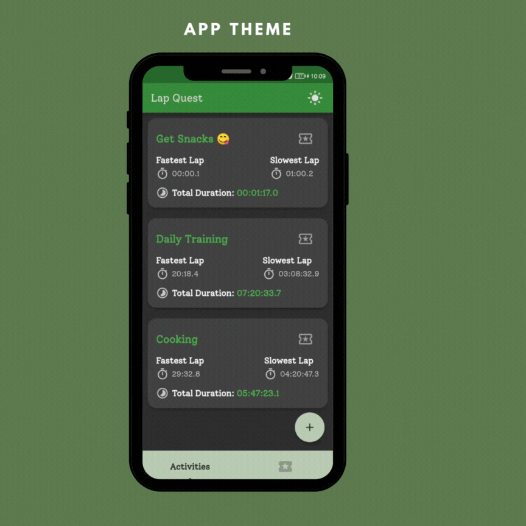

# Lap Quest ⌛

Lap Quest is an innovative stopwatch app built with clean architecture and powered by Flutter. Seamlessly manage multiple activities, each with its own stopwatch and lap history. It is the ultimate companion for your activity pursuits.

</a>

## Screenshots

</a>
</a>
</a>

## Features
- Create and manage multiple activities, each with its own stopwatch.
- Start, pause, and reset stopwatches for different activities.
- Record lap times and view lap history.
- Display the best and worst laps for each activity.
- Toggle between light and dark theme for a customized user experience.

## Getting Started

Follow these instructions to get the app up and running on your local machine.

### Prerequisites

Before running the app, make sure you have Flutter installed on your system. If you haven't installed Flutter yet, follow the official Flutter installation guide: [Flutter Installation](https://flutter.dev/docs/get-started/install)

### Installing

1. Clone this repository to your local machine using Git:

```
git clone https://github.com/eliascreates/lap-quest.git
```

2. Change to the project directory:

```
cd lap-quest
```

3. Install the required dependencies:

```
flutter pub get
```

4. Run the app:

```
flutter run
```

The app should now be running on your emulator or connected device.
*N.B: Note that you may need to rename the folder name replacing - with underscore.*

## Folder Structure

The project follows a Clean Architecture structure to separate concerns and make the codebase maintainable and scalable.

`lib`/
├── config/ \
│ ├── debug/ \
│ ├── routes/ \
│ └── themes/ \
├── config/ \
├── `features`/ \
│ ├── `activity`/ \
│ │ ├── data/ \
│ │ ├── domain/ \
│ │ └── presentation/ \
│ ├── `stopwatch`/ \
│ ├── . . . \
└── main.dart \

## State Management

The app uses the BLoC (Business Logic Component) pattern for state management. BLoC allows for separation of UI and business logic and provides a clean way to manage the state of the application.

## Data Storage
- Activity data are stored efficiently using the Isar database.
- Theme preferences are stored using Hydrated Bloc (Hive).

## Themes

Lap Quest offers both light and dark themes to provide a personalized user experience. You can switch between themes from the app settings.

</a>

## Getting Started

This project is a starting point for a Flutter application.

A few resources to get you started if this is your first Flutter project:

- [Lab: Write your first Flutter app](https://docs.flutter.dev/get-started/codelab)
- [Cookbook: Useful Flutter samples](https://docs.flutter.dev/cookbook)

For help getting started with Flutter development, view the
[online documentation](https://docs.flutter.dev/), which offers tutorials,
samples, guidance on mobile development, and a full API reference.
